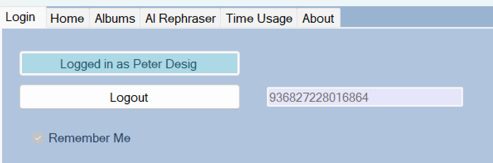
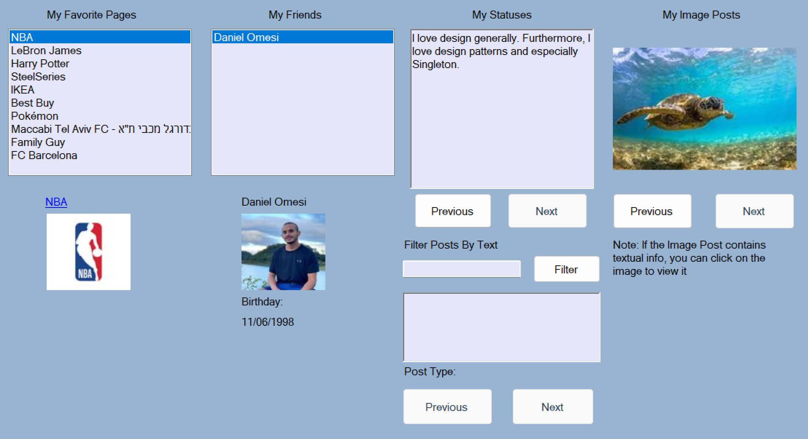
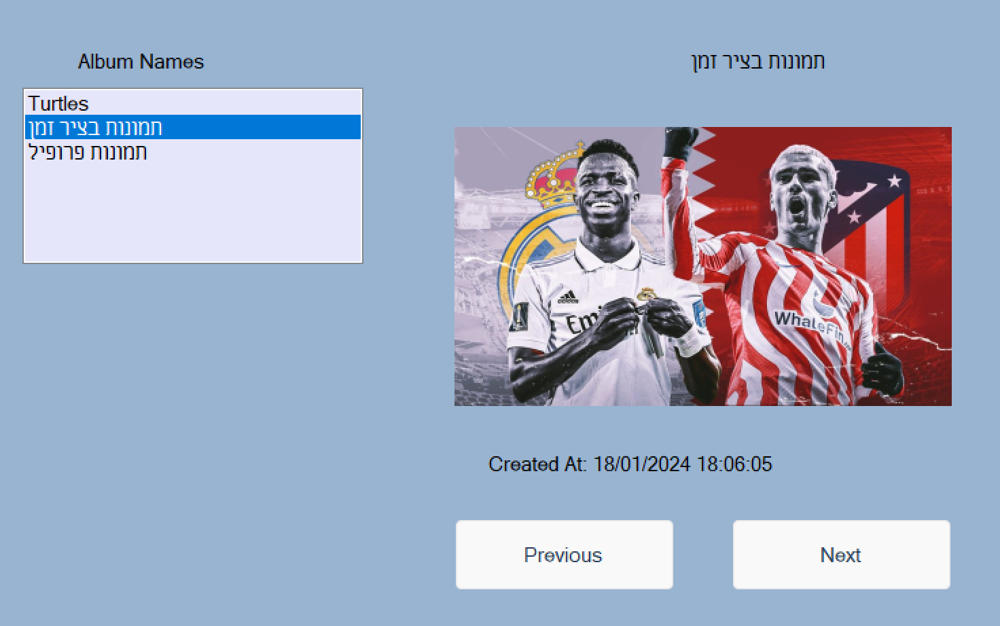
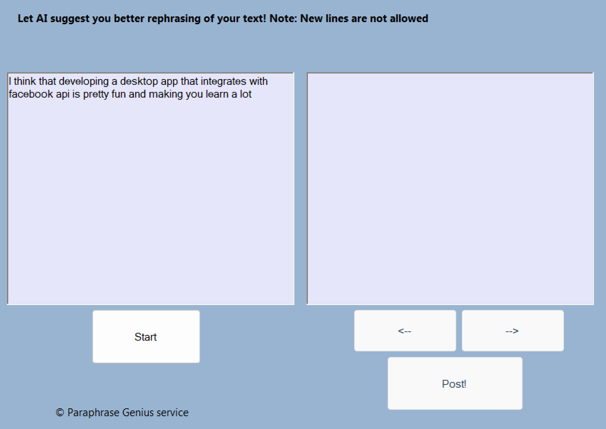
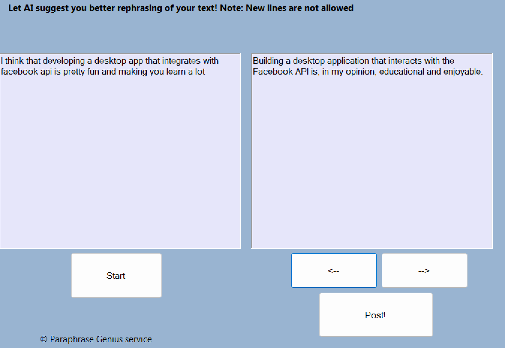
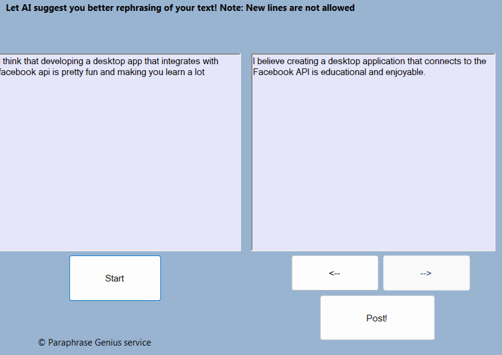
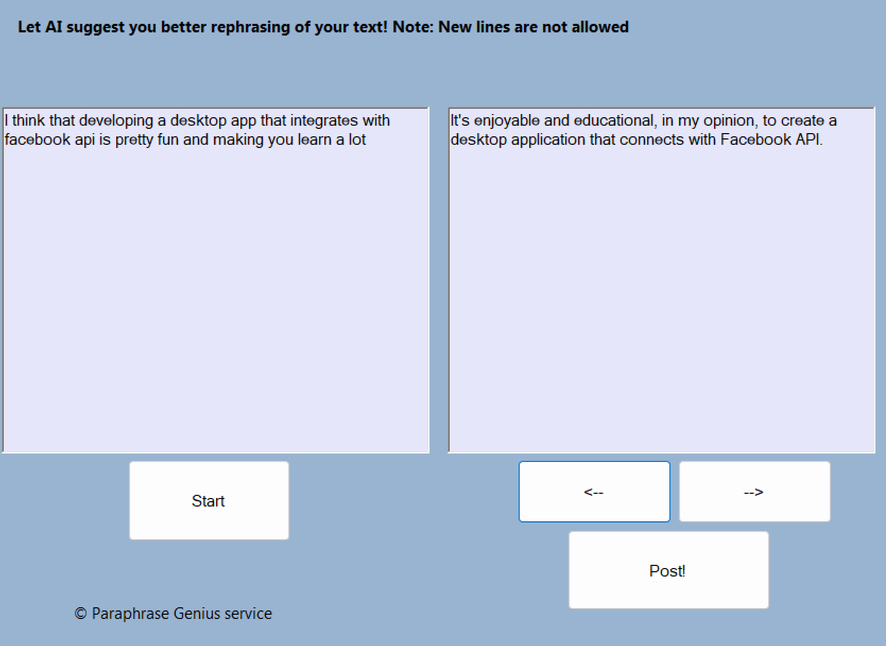
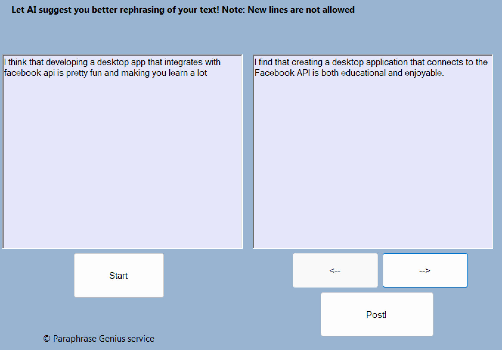
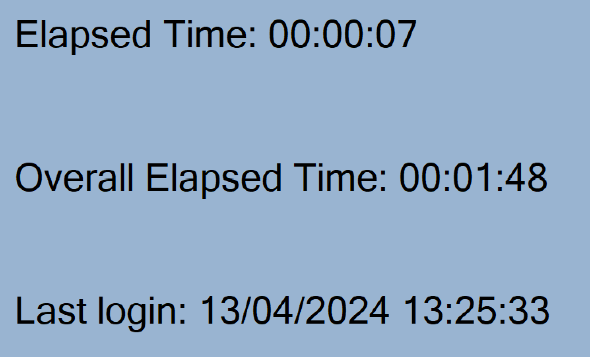
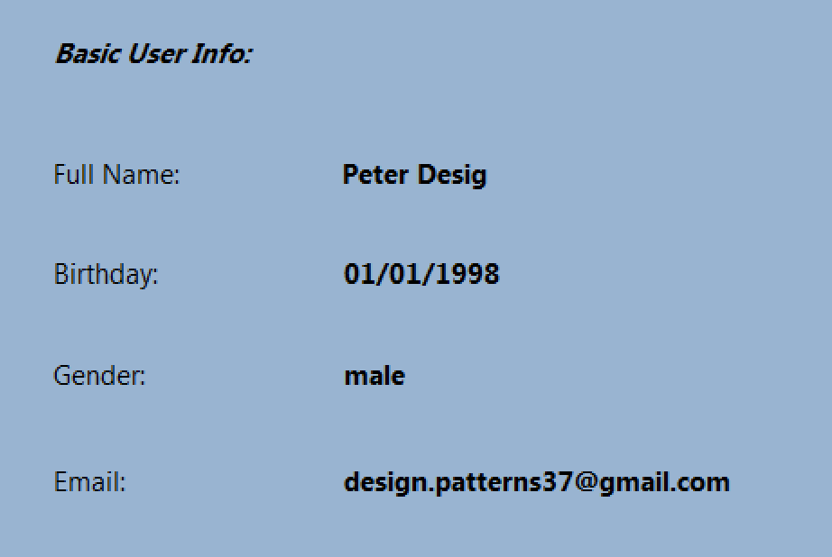

# Facebook Desktop App in WinForms
During a Design Patterns course, me and my fellow student Gal Suliman (https://github.com/gal-s2) developed a WinForms C# app using the Facebook API. We enhanced it with additional features for a more versatile user experience.

## Login
Here you can log into to your account, and see your login status if you are already logged in.

## Home
Here you can get a look on your favorite pages, friends, statuses, image posts. You can also filter your posts by text and navigate through the results.

## Albums
Here you can view your albums list and look at each photo in each album.

## AI Rephraser Feature
In this instance, we utilized a service called Paraphrase Genius by Genius Tools (https://rapidapi.com/genius-tools-genius-tools-default/api/paraphrase-genius) to obtain multiple rephrasing suggestions for a given text. Our interaction with this service was facilitated using the HTTP protocol

Example:
Input Text:

Output:

#1

#2

#3

#4

## Time Usuage Feature
This feature lets users track their usage time within the app, enabling them to see how much time they spend using it in the current session or since they last logged in.

Whenever the app is closed, we utilize XMLSerializer to save the time data into a file. Then, upon launching the app, the program deserializes the file (if it exists).

Similarly, we employ a comparable method to save the app's basic settings, such as window size, etc.

## About
A section which gives basic details about the user.

